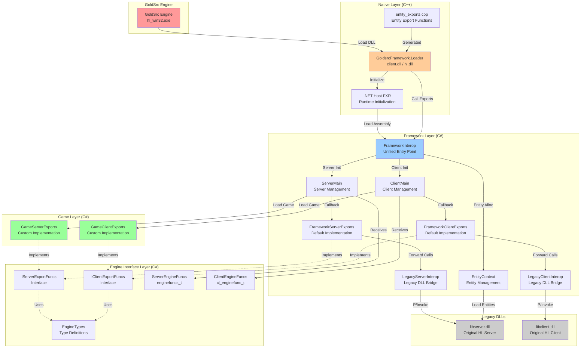
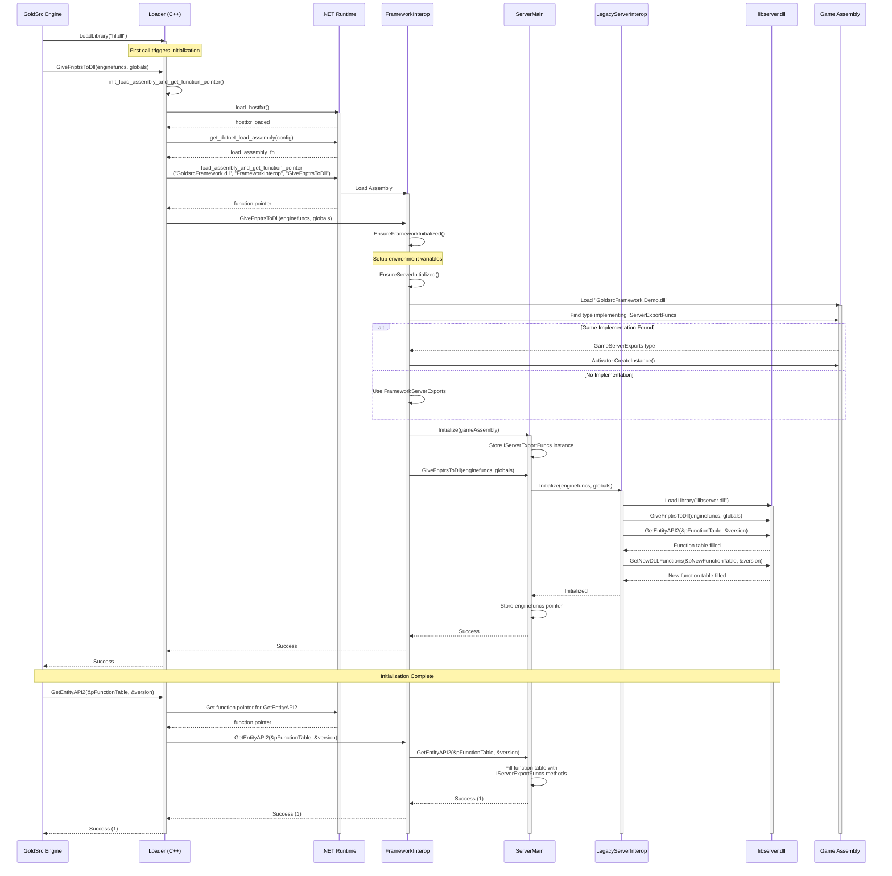
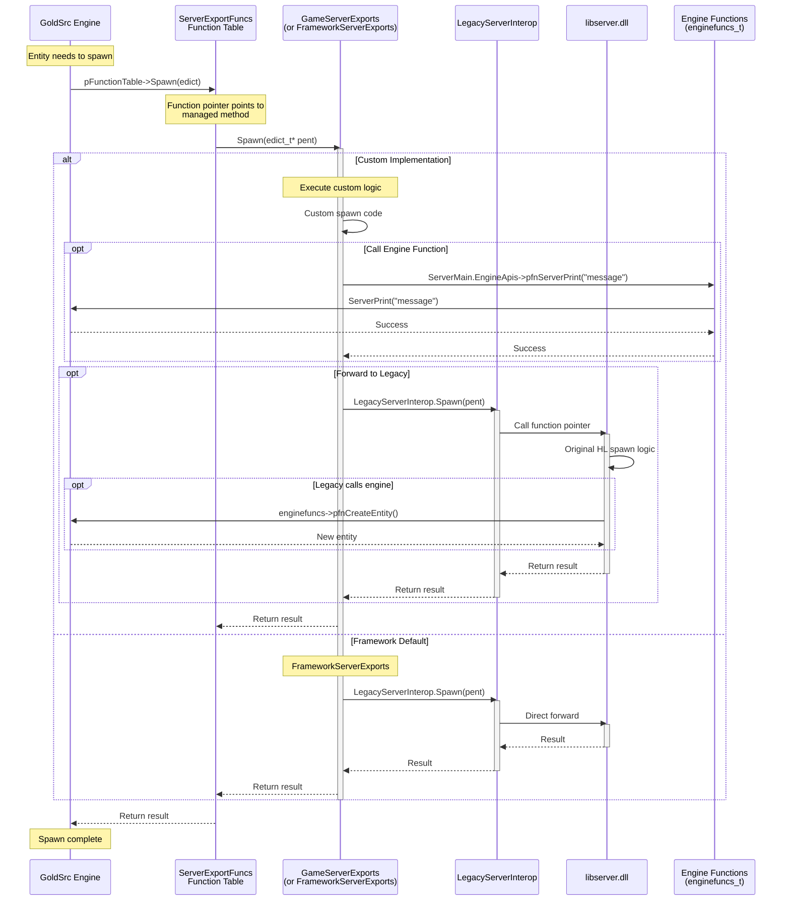

# GoldsrcFramework 架构图集

本文档包含 GoldsrcFramework 的所有架构图和流程图。这些图表使用 Mermaid 格式绘制，可以在支持 Mermaid 的 Markdown 查看器中查看。

## 目录

1. [整体架构图](#1-整体架构图)
2. [服务端初始化流程](#2-服务端初始化流程)
3. [运行时函数调用流程](#3-运行时函数调用流程)
4. [实体私有数据分配流程](#4-实体私有数据分配流程)
5. [类型系统和接口层次结构](#5-类型系统和接口层次结构)
6. [构建和部署流程](#6-构建和部署流程)
7. [数据流和内存管理](#7-数据流和内存管理)

---

## 1. 整体架构图

展示 GoldsrcFramework 的整体架构，包括各个层次和组件之间的关系。

**关键组件说明**:
- **红色**: GoldSrc 引擎
- **橙色**: 原生 C++ 加载器层
- **蓝色**: C# 框架层
- **绿色**: 游戏逻辑层
- **灰色**: 原版 Half-Life DLL

---

## 2. 服务端初始化流程

展示服务端从引擎加载到完全初始化的完整流程。

**关键步骤**:
1. 引擎加载 hl.dll (实际是 Loader)
2. Loader 初始化 .NET 运行时
3. 加载 GoldsrcFramework.dll
4. 加载游戏程序集 (GoldsrcFramework.Demo.dll)
5. 初始化 LegacyServerInterop 并加载 libserver.dll
6. 填充函数表返回给引擎

---

## 3. 运行时函数调用流程

展示运行时引擎调用游戏代码的流程 (以 Spawn 函数为例)。

**调用路径**:
- **自定义实现**: Engine → FuncTable → GameExports → [Custom Logic] → [Optional: LegacyInterop → libserver.dll]
- **框架默认**: Engine → FuncTable → FrameworkServerExports → LegacyInterop → libserver.dll

---

## 4. 实体私有数据分配流程

展示实体私有数据的分配机制。

请参考 Architecture.md 文档中的详细说明和 Mermaid 图表。

---

## 5. 类型系统和接口层次结构

展示框架中的类型系统、接口和类之间的关系。

请参考 Architecture.md 文档中的类图。

---

## 6. 构建和部署流程

展示从源代码到最终部署的完整构建流程。

请参考 Architecture.md 文档中的构建流程图。

---

## 7. 数据流和内存管理

展示不同内存空间之间的数据流动和指针关系。

请参考 Architecture.md 文档中的数据流图。

---

## 图表使用说明

### 在线查看

这些 Mermaid 图表可以在以下环境中查看:
- GitHub (原生支持 Mermaid)
- Visual Studio Code (安装 Mermaid 插件)
- Mermaid Live Editor: https://mermaid.live/

### 导出图片

可以使用以下工具将 Mermaid 图表导出为图片:
- Mermaid CLI: `mmdc -i input.md -o output.png`
- Mermaid Live Editor: 在线编辑并导出

### 修改图表

所有图表都使用 Mermaid 语法编写，可以直接编辑 Markdown 文件中的图表代码。

---

## 相关文档

- [Architecture.md](./Architecture.md) - 详细架构文档
- [README.md](../README.md) - 项目说明
- [Guide.md](../src/Guide.md) - 开发指南

