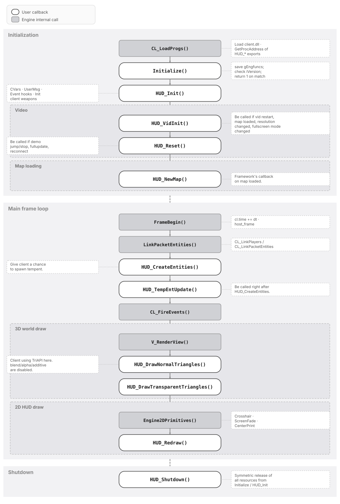

# GoldSrc Client Export Functions Execution Order

This document describes the execution order and phase division of the callback functions exported by the GoldSrc HLSDK client library (`client.dll` / `client.so`) to the engine.

## Execution Order Diagram



## Pseudocode Reference (For Maintenance)

The structure in the diagram above can be described by the following C#-style pseudocode. You can modify this pseudocode and regenerate the SVG:

```csharp
#region Initialization

    CL_LoadProgs();             // Engine: Load client.dll · GetProcAddress of HUD_* exports
    Initialize();               // save gEngfuncs; check iVersion; return 1 on match
    HUD_Init();                 // NOTE_LEFT: CVars · UserMsg · Event hooks · Init client weapons

    #region Video
        HUD_VidInit();          // NOTE_RIGHT: Be called if vid restart, map loaded, resolution changed, fullscreen mode changed
        HUD_Reset();            // NOTE_LEFT: Be called if demo jump/stop, fullupdate, reconnect
    #endregion

    #region Map loading
        HUD_NewMap();           // Framework's callback on map loaded.
    #endregion

#endregion

#region Main frame loop

    FrameBegin();               // Engine: cl.time += dt · host_frame
    LinkPacketEntities();       // Engine: CL_LinkPlayers / CL_LinkPacketEntities
    HUD_CreateEntities();       // NOTE_LEFT: Give client a chance to spawn tempent.
    HUD_TempEntUpdate();        // NOTE_RIGHT: Be called right after HUD_CreateEntities.
    CL_FireEvents();

    #region 3D world draw
        V_RenderView();
        HUD_DrawNormalTriangles();      // NOTE_LEFT: Client using TriAPI here. blend/alpha/additive are disabled.
        HUD_DrawTransparentTriangles();
    #endregion

    #region 2D HUD draw
        Engine2DPrimitives();   // Engine: Crosshair · ScreenFade · CenterPrint
        HUD_Redraw();
    #endregion

#endregion

#region Shutdown
    HUD_Shutdown();             // NOTE_RIGHT: Symmetric release of all resources from Initialize / HUD_Init
#endregion
## Notes

The 3D world is advanced inside `HUD_TempEntUpdate` using the supplied `frametime` (delta time) to integrate positions (`position += velocity * frametime`). Rendering occurs later in `HUD_DrawNormalTriangles` and `HUD_DrawTransparentTriangles`.

The 2D HUD is advanced and rendered inside `HUD_Redraw`. The delta time used for HUD animations is derived from the supplied game time by subtracting the stored game time of the previous frame. Since `HUD_Redraw` is invoked even during pause (to redraw the HUD), deriving delta time this way prevents animations from advancing while paused: the engine passes the same game time value on every call, so the computed delta time is zero.