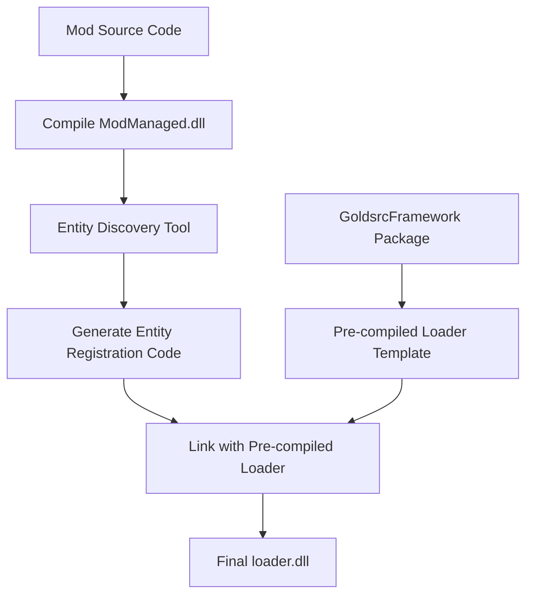

# Entity Private Data Allocation Proposal

## Overview

This document outlines the proposed architecture for automatic entity private data allocation in GoldsrcFramework, eliminating the need for mod developers to write boilerplate entity registration code.

## Background

### Traditional Half-Life Entity Registration

In traditional Half-Life mod development, entities are registered using the `LINK_ENTITY_TO_CLASS` macro:

```cpp
LINK_ENTITY_TO_CLASS(weapon_mp5, CMP5);
```

This macro expands to:

```cpp
extern "C" __declspec(dllexport) void weapon_mp5(entvars_t* pev);
void weapon_mp5(entvars_t* pev)
{
    GetClassPtr((CMP5*)pev);
}
```

### Purpose and Mechanism

The fundamental purpose of this mechanism is to:

1. **Allocate Private Data**: Create mod-specific private data structures for entities
2. **Store Reference**: Store the allocated private data pointer in `edict_t::v` (void pointer member)
3. **Engine Integration**: Provide exported functions that the engine can call to instantiate entities

## Problem Statement

The current GoldsrcFramework architecture requires:

- **Loader DLL**: An unmanaged DLL that directly interfaces with the engine
- **Managed Mod DLL**: Contains the actual mod logic written in C#

However, we want to avoid requiring mod developers to write boilerplate entity registration code in the loader DLL for each entity (e.g., `weapon_mp5`, `weapon_ak47`, etc.).

## Proposed Solution

### Architecture Overview

1. **GoldsrcFramework Distribution**: Framework components (including loader) will be distributed as NuGet packages
2. **Project Template**: Mod developers create projects using `dotnet new` templates
3. **Build Output**: Compilation produces:
   - `loader.dll` (unmanaged, engine interface)
   - `GoldsrcFramework.dll` (framework modules)
   - `YourModManaged.dll` (mod-specific managed code)

### Implementation Strategy

#### Phase 1: Pre-built Loader Template

During GoldsrcFramework packaging, generate a semi-compiled loader in one of these forms:
- `loader.cpp` (source template)
- `loader.obj` (pre-compiled object file)

#### Phase 2: Entity Discovery

The framework provides a discovery mechanism:

```csharp
[UnmanagedCallersOnly]
public static IntPtr GetPrivateAllocator(string entityClassName);
```

#### Phase 3: Build-Time Code Generation

During mod compilation, a toolchain:

1. **Discovers Entities**: Analyzes `ModManaged.dll` to identify entities through:
   - Source code analysis
   - Reflection on compiled assembly
   - Execution of discovery methods

2. **Generates Entity List**: Produces a list like `[weapon_mp5, weapon_mp6, weapon_mp7, ...]`

3. **Code Generation**: Creates entity registration code based on discovered entities
#### Phase 4: Final Linking

The generated code is linked with the pre-compiled loader to produce the final `loader.dll`.

## Generated Code Structure

### Function Table Definition

```c
// Generated based on discovered entities
struct PrivateDataAllocFuncs
{
    void* (*weapon_mp5)(void* pev);
    void* (*weapon_ak47)(void* pev);
    void* (*func_door)(void* pev);
    // ... additional entities
};

// Global function table instance
struct PrivateDataAllocFuncs g_allocFuncs;
```

### Entity Export Functions

For each discovered entity, generate an exported function:

```c
// Generated for weapon_mp5
extern "C" __declspec(dllexport) void weapon_mp5(entvars_t* pev);
void weapon_mp5(entvars_t* pev)
{
    // Call into managed code through function pointer
    g_allocFuncs.weapon_mp5(pev);
}

// Generated for weapon_ak47
extern "C" __declspec(dllexport) void weapon_ak47(entvars_t* pev);
void weapon_ak47(entvars_t* pev)
{
    g_allocFuncs.weapon_ak47(pev);
}

// Generated for func_door
extern "C" __declspec(dllexport) void func_door(entvars_t* pev);
void func_door(entvars_t* pev)
{
    g_allocFuncs.func_door(pev);
}
```

### Initialization Function

```c
// Called during server DLL initialization
void InitializePrivateDataAllocators()
{
    // Populate function table with managed code entry points
    g_allocFuncs.weapon_mp5 = GetPrivateAllocator("weapon_mp5");
    g_allocFuncs.weapon_ak47 = GetPrivateAllocator("weapon_ak47");
    g_allocFuncs.func_door = GetPrivateAllocator("func_door");
    // ... additional entities
}
```

## Implementation Details

### Entity Discovery Methods

#### Method 1: Source Code Analysis
- Parse C# source files during build
- Identify classes that inherit from entity base classes
- Extract entity class names and registration attributes

#### Method 2: Reflection-Based Discovery
- Load compiled `ModManaged.dll`
- Use reflection to find entity classes
- Query custom attributes for entity registration information

#### Method 3: Explicit Registration
- Provide a registration API in managed code
- Mod developers explicitly register entities
- Build tools query the registration system

### Framework Integration Points

#### Managed Side Interface

```csharp
// Framework provides this interface
public interface IEntityAllocator
{
    IntPtr AllocatePrivateData(string entityClassName, IntPtr pev);
    void DeallocatePrivateData(IntPtr privateData);
}

// Implementation in GoldsrcFramework
[UnmanagedCallersOnly]
public static IntPtr GetPrivateAllocator(string entityClassName)
{
    // Return function pointer for specific entity allocator
    return EntityRegistry.GetAllocator(entityClassName);
}
```

#### Build Tool Integration

```csharp
// Build-time tool interface
public interface IEntityDiscovery
{
    IEnumerable<string> DiscoverEntities(string assemblyPath);
    void GenerateLoaderCode(IEnumerable<string> entities, string outputPath);
}
```

## Benefits

### For Mod Developers
1. **Reduced Boilerplate**: No need to write entity registration code
2. **Type Safety**: Managed code benefits with compile-time checking
3. **Simplified Workflow**: Focus on game logic rather than infrastructure
4. **Automatic Discovery**: Entities are automatically detected and registered

### For Framework Maintainers
1. **Consistent Architecture**: Standardized entity registration across all mods
2. **Maintainable Code**: Centralized entity management logic
3. **Extensible Design**: Easy to add new entity types and features
4. **Performance**: Optimized allocation and deallocation paths

## Build Process Flow



## Future Considerations

### Performance Optimizations
- **Function Pointer Caching**: Cache frequently used allocators
- **Batch Allocation**: Support for allocating multiple entities efficiently
- **Memory Pool Management**: Implement custom memory pools for entity data

### Advanced Features
- **Hot Reload**: Support for reloading entity definitions at runtime
- **Entity Validation**: Compile-time validation of entity configurations
- **Debugging Support**: Enhanced debugging tools for entity lifecycle

### Compatibility
- **Legacy Support**: Maintain compatibility with existing Half-Life mods
- **Engine Variants**: Support for different GoldSrc engine versions
- **Platform Support**: Ensure cross-platform compatibility

## Conclusion

This proposal provides a comprehensive solution for automatic entity private data allocation in GoldsrcFramework. By eliminating boilerplate code and providing a streamlined development experience, it enables mod developers to focus on creating engaging gameplay rather than dealing with low-level infrastructure concerns.

The proposed architecture maintains compatibility with the existing Half-Life engine while providing modern development conveniences through managed code integration.